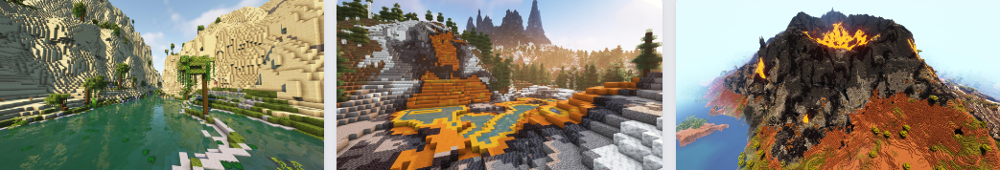
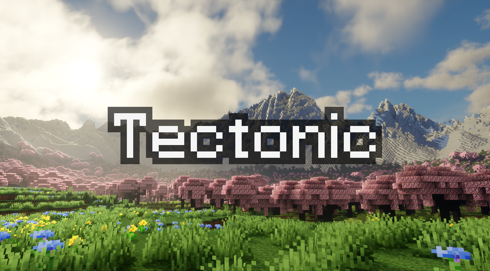
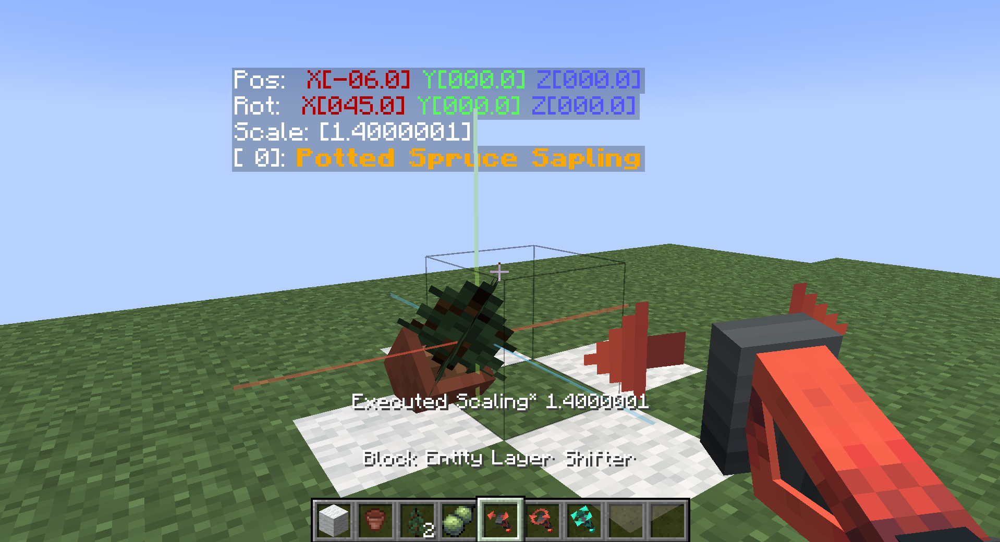
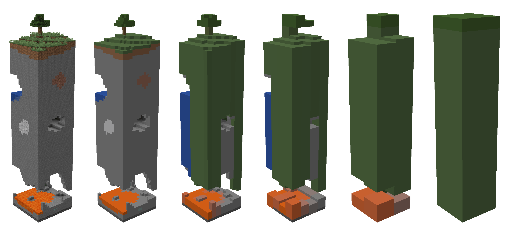
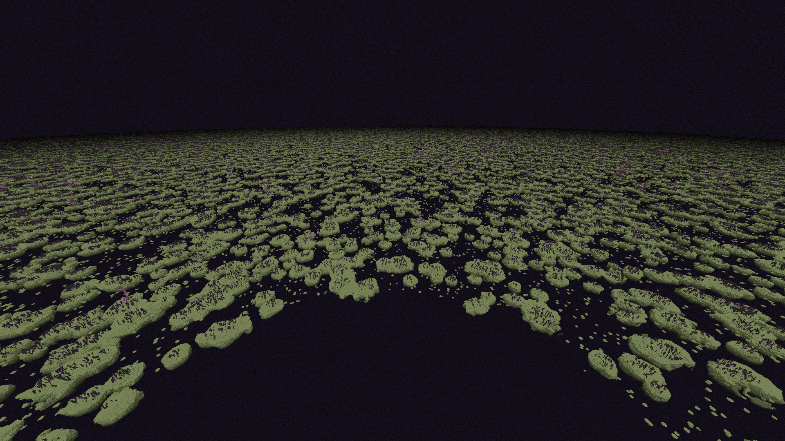
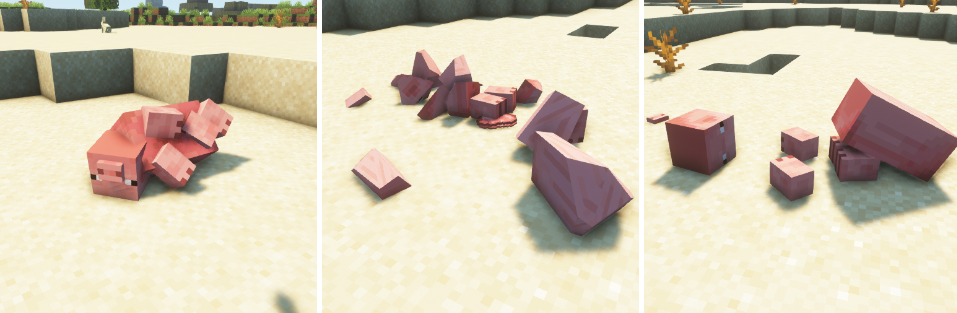
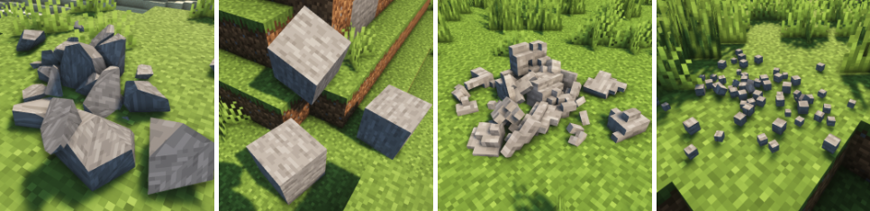

!!! danger "Working In Progress"
    本页面仍在完善过程中，内容仍不完整

本页面会对 AzurCraft 使用的 Mod 做一些介绍

## 一、地形、生物群系、结构

由于改变了原版地形的生成，因此常用的 ChunkBase 地形查看工具也就不太适用了，这里推荐一个可以加载 Mod 的地图查看工具：

[Minecraft Datapack Map](https://map.jacobsjo.eu/?lang=zh_CN)

可以在左上角点击加号添加 Mod。

1. [Terralith](https://modrinth.com/mod/terralith)

    > slug: `terralith`

    为原版的生物群系添加了新的特性，并拓展了 95+ 种新的 **生物群系**，同时添加了很多 **结构**。

    

2. [Tectonic](https://modrinth.com/datapack/tectonic)

    > slug: `tectonic`

    

    重塑原版的 **地形生成** 算法

## 二、建筑相关

1. [Yuushya Townscape](https://modrinth.com/mod/yuushya-townscape) 和 [Yuushya Modelling](https://modrinth.com/mod/yuushya-modelling)

    > slug: `yuushya-townscape` 和 `yuushya-modelling`

    
    

    Yuushya Townscape 添加了 2600+ 建筑材料，而 Tuushya Modelling 更是添加了移动、旋转、缩放方块的工具。

    !!! warning
        注意，需要搭配 [Yuushya 16x](https://modrinth.com/resourcepack/yuushya-16x) 材质包进行使用。

2. [Horizontal Glass Panes](https://modrinth.com/mod/horizontal-glass-panes)

    > slug: `horizontal-glass-panes`

    添加了水平玻璃板。

3. [Stoneworks](https://modrinth.com/mod/stoneworks)

    > slug: `stoneworks`

    添加了很多石质方块。

## 三、视觉相关

1. [Distant Horizons](https://modrinth.com/mod/distanthorizons/)

    > slug: `distanthorizons`

    
    

    通过 LOD 技术使得在保证帧数的情况下的超远可视距离成为可能。

    游戏中的渲染距离设置还是正常，但是渲染距离之外的地形（如果生成过且 Distant Horizons 计算过其 LOD）都会被渲染出来。

    !!! warning
        注意，支持其的光影较为有限，这里推荐几个：

        - [Photon Shader](https://modrinth.com/shader/photon-shader)

2. [Visual Workbench](https://modrinth.com/mod/visual-workbench)

    > slug: `visual-workbench`

    在工作台表面显示出正在使用的人放置的物品。

3. [Physics Mod](https://modrinth.com/mod/physicsmod)

    > slug: `physicsmod`

    
    

    很多可配置的酷炫的物理效果。